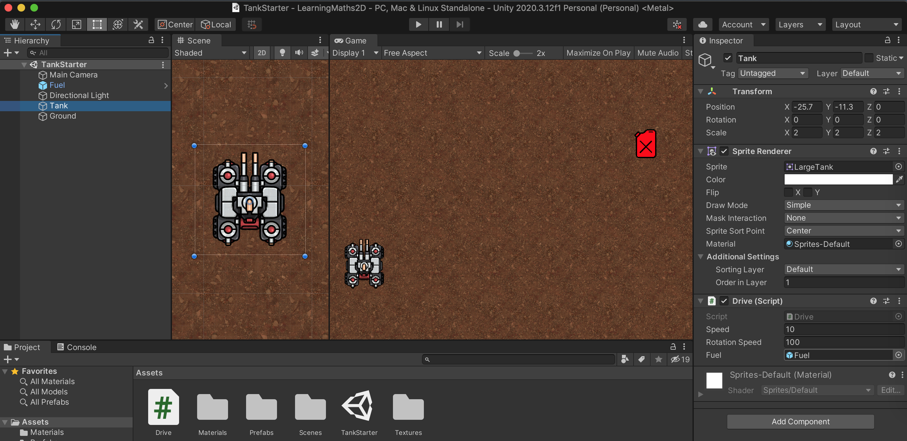
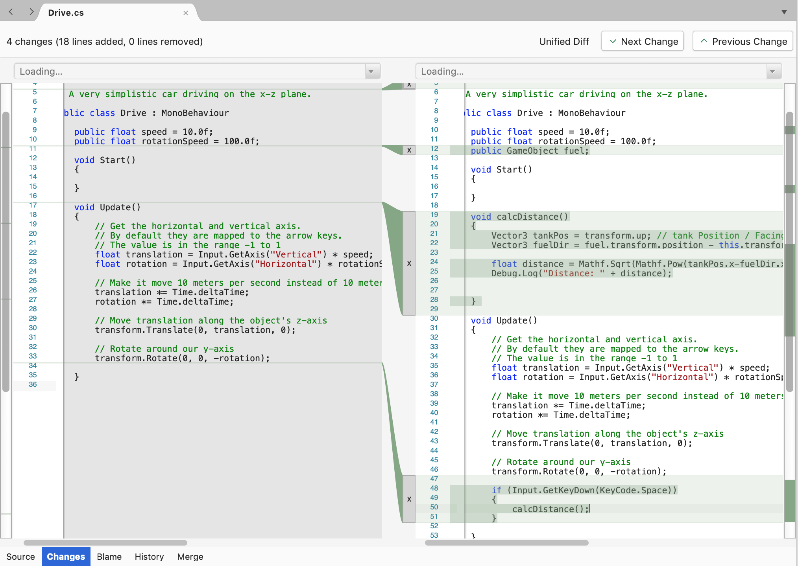

## Demo01 - Calculate Distances the old fashioned way - welcome to Pythagoras's theorem

This course is going to get into some pretty advanced maths, but it starts with relatively simple high school maths around generating vectors to find the distince between two roaming game objects.

Before starting the course you do need to be familiar with Unity and switching between Unity GUI and Visual Studio, this is covered in https://learn.unity.com/pathway/unity-essentials. I give a few details below how these two tools integrate and how to link code to primary and secondary objects.


## Background maths

First a quick recap of Pythagoras's theorem

> In mathematics, the Pythagorean theorem, or Pythagoras's theorem, is a fundamental relation in Euclidean geometry among the three sides of a right triangle. It states that the area of the square whose side is the hypotenuse (the side opposite the right angle) is equal to the sum of the areas of the squares on the other two sides. This theorem can be written as an equation relating the lengths of the sides a, b and c, often called the Pythagorean equation:
**a^2 +b^2=c^2**
> where c represents the length of the hypotenuse and a and b the lengths of the triangle's other two sides. The theorem, whose history is the subject of much debate, is named for the Greek thinker Pythagoras, born around 570 BC ... https://en.wikipedia.org/wiki/Pythagorean_theorem

Next the other background maths concept is a Euclidean vectors (aka directed arrows)
> In mathematics, physics and engineering, a Euclidean vector or simply a vector (sometimes called a geometric vector[1] or spatial vector[2]) is a geometric object that has magnitude (or length) and direction. Vectors can be added to other vectors according to vector algebra. A Euclidean vector is frequently represented by a ray (a directed line segment), or graphically as an arrow connecting an initial point A with a terminal point B ... https://en.wikipedia.org/wiki/Euclidean_vector


## Code behind for "demo01 Calculate Distance Pythagoras theorem"

Basically there are two key things going on here
* My C# application code went into `Assets/Drive.cs`, principally the calcDistance() function
```
    void calcDistance()
    {
        Vector3 tankPos = transform.up; // tank Position / Facing direction
        Vector3 fuelDir = fuel.transform.position - this.transform.position; // relatvie vector pointing to Fuel

        float distance = Mathf.Sqrt(Mathf.Pow(tankPos.x-fuelDir.x,2)+ Mathf.Pow(tankPos.y - fuelDir.y, 2));
        Debug.Log("Distance: " + distance);

    } 
```
* however I also had to link the fuel (GameObject) to the Drive.cs script, which primarily associated with the Tank object, this was done by drag and drop in the GUI [top left to bottom right in the screenshot] 

* the other code tweak here is to trigger the calcDistance and logging when the user hits the spacebar:
```
    void Update()
    {
...

        if (Input.GetKeyDown(KeyCode.Space))
        {
            calcDistance();
        }

    }
}
```


## Commit log details

here is actual code...


```
~/projects/github/LearningMaths2D $ git commit -m "Demo01-Calculate-Distance-Pythagoras-theorem"
[main fc2fef9] Demo01-Calculate-Distance-Pythagoras-theorem
 2 files changed, 130 insertions(+), 14 deletions(-)
 mode change 100755 => 100644 Assets/Drive.cs
 mode change 100755 => 100644 Assets/TankStarter.unity
~/projects/github/LearningMaths2D $ git log -1
commit fc2fef969ea3620a7898b5cb87fedce4c48bd8e0 (HEAD -> main)
Author: Dave Pitts <dgapitts@gmail.com>
Date:   Sat Aug 7 10:43:40 2021 +0200

    Demo01-Calculate-Distance-Pythagoras-theorem
~/projects/github/LearningMaths2D $ git show fc2fef969ea3620a7898b5cb87fedce4c48bd8e0
commit fc2fef969ea3620a7898b5cb87fedce4c48bd8e0 (HEAD -> main)
Author: Dave Pitts <dgapitts@gmail.com>
Date:   Sat Aug 7 10:43:40 2021 +0200

    Demo01-Calculate-Distance-Pythagoras-theorem

diff --git a/Assets/Drive.cs b/Assets/Drive.cs
old mode 100755
new mode 100644
index 100eb50..d519173
--- a/Assets/Drive.cs
+++ b/Assets/Drive.cs
@@ -2,18 +2,31 @@
 using System.Collections;
 using UnityEngine.UI;

+^M
 // A very simplistic car driving on the x-z plane.

 public class Drive : MonoBehaviour
 {
     public float speed = 10.0f;
     public float rotationSpeed = 100.0f;
+    public GameObject fuel;^M

     void Start()
     {

     }

+    void calcDistance()^M
+    {^M
+        Vector3 tankPos = transform.up; // tank Position / Facing direction^M
+        Vector3 fuelDir = fuel.transform.position - this.transform.position; // relatvie vector pointing to Fuel^M
+^M
+        float distance = Mathf.Sqrt(Mathf.Pow(tankPos.x-fuelDir.x,2)+ Mathf.Pow(tankPos.y - fuelDir.y, 2));^M
+        Debug.Log("Distance: " + distance);^M
+^M
+^M
+    } ^M
+^M
     void Update()
     {
         // Get the horizontal and vertical axis.
@@ -32,5 +45,10 @@ public class Drive : MonoBehaviour
         // Rotate around our y-axis
         transform.Rotate(0, 0, -rotation);

+        if (Input.GetKeyDown(KeyCode.Space))
+        {
+            calcDistance();
+        }^M
+^M
     }
 }
\ No newline at end of file
diff --git a/Assets/TankStarter.unity b/Assets/TankStarter.unity
old mode 100755
new mode 100644
index 92faf76..3cc8041
--- a/Assets/TankStarter.unity
+++ b/Assets/TankStarter.unity
@@ -38,12 +38,12 @@ RenderSettings:
   m_ReflectionIntensity: 1
   m_CustomReflection: {fileID: 0}
   m_Sun: {fileID: 0}
-  m_IndirectSpecularColor: {r: 0.44657898, g: 0.49641287, b: 0.5748173, a: 1}
+  m_IndirectSpecularColor: {r: 0.44657868, g: 0.49641263, b: 0.5748171, a: 1}
   m_UseRadianceAmbientProbe: 0
 --- !u!157 &3
 LightmapSettings:
   m_ObjectHideFlags: 0
-  serializedVersion: 11
+  serializedVersion: 12
   m_GIWorkflowMode: 0
   m_GISettings:
     serializedVersion: 2
@@ -94,10 +94,11 @@ LightmapSettings:
     m_PVRFilteringAtrousPositionSigmaDirect: 0.5
     m_PVRFilteringAtrousPositionSigmaIndirect: 2
     m_PVRFilteringAtrousPositionSigmaAO: 1
-    m_ShowResolutionOverlay: 1
     m_ExportTrainingData: 0
+    m_TrainingDataDestination: TrainingData
+    m_LightProbeSampleCountMultiplier: 4
   m_LightingDataAsset: {fileID: 0}
-  m_UseShadowmask: 1
+  m_LightingSettings: {fileID: 1291475361}
 --- !u!196 &4
 NavMeshSettings:
   serializedVersion: 2
@@ -117,6 +118,8 @@ NavMeshSettings:
     manualTileSize: 0
     tileSize: 256
     accuratePlacement: 0
+    maxJobWorkers: 0
+    preserveTilesOutsideBounds: 0
     debug:
       m_Flags: 0
   m_NavMeshData: {fileID: 0}
@@ -145,8 +148,9 @@ Light:
   m_PrefabAsset: {fileID: 0}
   m_GameObject: {fileID: 170076733}
   m_Enabled: 1
-  serializedVersion: 9
+  serializedVersion: 10
   m_Type: 1
+  m_Shape: 0
## Intro
   m_Color: {r: 1, g: 0.95686275, b: 0.8392157, a: 1}
   m_Intensity: 1
   m_Range: 10
@@ -161,6 +165,24 @@ Light:
     m_Bias: 0.05
     m_NormalBias: 0.4
     m_NearPlane: 0.2
+    m_CullingMatrixOverride:
+      e00: 1
+      e01: 0
+      e02: 0
+      e03: 0
+      e10: 0
+      e11: 1
+      e12: 0
+      e13: 0
+      e20: 0
+      e21: 0
+      e22: 1
+      e23: 0
...
```