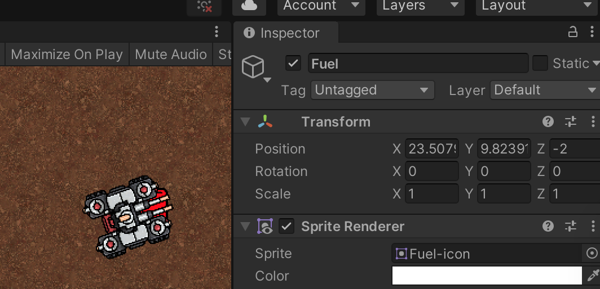

## Demo02 debugging minor calculateDistance function differences with Vector3 object (3D not 2D!)

Continuing from demo01, we are introduced to the 

```

    void calcDistance()
    {
        Vector3 tankPos = transform.up; // tank Position / Facing direction
        Vector3 fuelDir = fuel.transform.position - this.transform.position; // relatvie vector pointing to Fuel

        float distance = Mathf.Sqrt(Mathf.Pow(tankPos.x-fuelDir.x,2)+ Mathf.Pow(tankPos.y - fuelDir.y, 2));
        float unityDistance = Vector3.Distance(tankPos, fuelDir); // regular unity built in method (which should agree with Pythagoras's theorem)
        float delta = distance - unityDistance; // lets see if our calculation to match up 

        Debug.Log("Distance: " + distance);
        Debug.Log("unityDistance: " + unityDistance);
        Debug.Log("delta: " + delta);
    } 
```

Initially we appear to have a small error i.e. (to 4 DP) 50.8124 vs 50.8517
```
Distance: 50.81238
UnityEngine.Debug:Log (object)
Drive:calcDistance () (at Assets/Drive.cs:28)
Drive:Update () (at Assets/Drive.cs:55)

unityDistance: 50.85173
UnityEngine.Debug:Log (object)
Drive:calcDistance () (at Assets/Drive.cs:29)
Drive:Update () (at Assets/Drive.cs:55)

delta: -0.03934479
UnityEngine.Debug:Log (object)
Drive:calcDistance () (at Assets/Drive.cs:30)
Drive:Update () (at Assets/Drive.cs:55)
```

but as we get closer the error appears to get bigger i.e. 0.9150 is not even close to 2.199

```
Distance: 0.9149726
UnityEngine.Debug:Log (object)
Drive:calcDistance () (at Assets/Drive.cs:28)
Drive:Update () (at Assets/Drive.cs:55)

unityDistance: 2.199358
UnityEngine.Debug:Log (object)
Drive:calcDistance () (at Assets/Drive.cs:29)
Drive:Update () (at Assets/Drive.cs:55)

delta: -1.284385
UnityEngine.Debug:Log (object)
Drive:calcDistance () (at Assets/Drive.cs:30)
Drive:Update () (at Assets/Drive.cs:55)
```

so what is going wrong, lets not blame Pythagoras!

## Using the Unity GUI Inspector ...

### Demo02-tankPosition-inspector-details-Z-is-0-as-expected

This looks okay:


### Demo02-fuelPosition-inspector-details-Z-is-2-NOT-as-expected

BUT comparing to ...

	

### BINGO here is our error:
* we're using a **2D version of Pythagoras's theorem BUT in a "3D space"**, i.e. we need to add the 3rd dimension (Z-dimension) to the calculation e.g. something like
```
float distance = Mathf.Sqrt(Mathf.Pow(tankPos.x-fuelDir.x,2)+ Mathf.Pow(tankPos.y - fuelDir.y, 2)+Mathf.Pow(tankPos.z - fuelDir.z, 2));
```
* **alternatively** we could have just made z=0 (we seems fair to me - we imagining a flat/2D space but using a 3D model)


## Commit log details

```
~/projects/github/LearningMaths2D $ git show git commit -m "Demo02 debugging minor calculateDistance function differences Vector3 object (3D not 2D!)"
~/projects/github/LearningMaths2D $ git show e40e513d5325906d6fd5d778192ecd61059ce22d
commit e40e513d5325906d6fd5d778192ecd61059ce22d (HEAD -> main)
Author: Dave Pitts <dgapitts@gmail.com>
Date:   Sat Aug 7 14:27:03 2021 +0200

    Demo02 debugging minor calculateDistance function differences Vector3 object (3D not 2D)

diff --git a/Assets/Drive.cs b/Assets/Drive.cs
index d519173..a7bef2c 100644
--- a/Assets/Drive.cs
+++ b/Assets/Drive.cs
@@ -22,7 +22,12 @@ public class Drive : MonoBehaviour
         Vector3 fuelDir = fuel.transform.position - this.transform.position; // relatvie vector pointing to Fuel

         float distance = Mathf.Sqrt(Mathf.Pow(tankPos.x-fuelDir.x,2)+ Mathf.Pow(tankPos.y - fuelDir.y, 2));
+        float unityDistance = Vector3.Distance(tankPos, fuelDir);^M
+        float delta = distance - unityDistance;^M
+^M
         Debug.Log("Distance: " + distance);
+        Debug.Log("unityDistance: " + unityDistance);^M
+        Debug.Log("delta: " + delta);^M


     }
```
