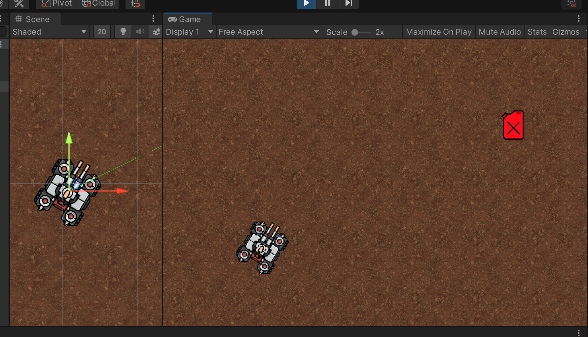

## Demo03 - Calculate Vectory Dot Product

## Visualizing vectors tankUp (Tank Upwards/Facing direction) and fuelDir (direction from Tank to Fuel)


The initial tank-vector view DrawRay / debugging, 

```
    void calcAngle()
    {
        Vector3 tankUp = transform.up; // tank Position / Facing direction
        Vector3 fuelDir = fuel.transform.position - this.transform.position; // relatvie vector pointing to Fue

        Debug.DrawRay(this.transform.position, tankUp * 3, Color.yellow, 15);
        Debug.DrawRay(this.transform.position, fuelDir, Color.green, 15);    
    }
```

looks slightly different in the 2020Q3 demo 



## How to calculate the angle between two vectors - trig reminder arccos()


Next there is a nice [course guide .pdf to calculate the angle between two vectors](Demo03-course-guide-calcAngleBetweenTwoVectors.pdf)


## Adding the code

```
    void calcAngle()
    {
        Vector3 tankUp = transform.up; // tank Position / Facing direction
        Vector3 fuelDir = fuel.transform.position - this.transform.position; // relatvie vector pointing to Fue
        float calcAngleRadians = Mathf.Acos(  ((tankUp.x*fuelDir.x)+(tankUp.y*fuelDir.y))
                                                 / (tankUp.magnitude*fuelDir.magnitude)  );
        Debug.Log("calcAngleRadians: " + calcAngleRadians);
        Debug.Log("Convert calcAngleRadians to regular angle" + (calcAngleRadians * Mathf.Rad2Deg));
        Debug.DrawRay(this.transform.position, tankUp * 3, Color.yellow, 3);
        Debug.DrawRay(this.transform.position, fuelDir, Color.green, 3);
       
    }
```

and also added the Vector3.Angle built in function, call to cross check my results

```
        // Final cross check using built in unity functions
        Debug.Log("Unity angle" + Vector3.Angle(tankUp, fuelDir));
```


## Demo - tank poiniting towards / away


## tank poiniting towards - close to 0 radians (0.07) /  0 degrees (4.0) 


```
calcAngleRadians: 0.07065956
UnityEngine.Debug:Log (object)
Drive:calcAngle () (at Assets/Drive.cs:25)
Drive:Update () (at Assets/Drive.cs:70)

Convert calcAngleRadians to regular angle: 4.048495
UnityEngine.Debug:Log (object)
Drive:calcAngle () (at Assets/Drive.cs:26)
Drive:Update () (at Assets/Drive.cs:70)

Unity angle: 4.048543
UnityEngine.Debug:Log (object)
Drive:calcAngle () (at Assets/Drive.cs:31)
Drive:Update () (at Assets/Drive.cs:70)
```


## tank poiniting away - close to π or 3.141 radians (3.07)  / 180 degrees (175) 

		

```
calcAngleRadians: 3.0708
UnityEngine.Debug:Log (object)
Drive:calcAngle () (at Assets/Drive.cs:25)
Drive:Update () (at Assets/Drive.cs:70)

Convert calcAngleRadians to regular angle: 175.9439
UnityEngine.Debug:Log (object)
Drive:calcAngle () (at Assets/Drive.cs:26)
Drive:Update () (at Assets/Drive.cs:70)

Unity angle: 175.9438
UnityEngine.Debug:Log (object)
Drive:calcAngle () (at Assets/Drive.cs:31)
Drive:Update () (at Assets/Drive.cs:70)
```


## convert radians to degrees


> 1rad × 180/π = 57,296°


## git log 


```
~/projects/github/LearningMaths2D/docs $ git show c2838f170a8911f3ab4db35caa5f63ee496b68ac
commit c2838f170a8911f3ab4db35caa5f63ee496b68ac (origin/main)
Author: Dave Pitts <dgapitts@gmail.com>
Date:   Sun Aug 15 15:18:37 2021 +0200

    added calcAngle function for the angle between two vectors - base calculation and built in function

diff --git a/Assets/Drive.cs b/Assets/Drive.cs
index a7bef2c..9364be4 100644
--- a/Assets/Drive.cs
+++ b/Assets/Drive.cs
@@ -14,22 +14,36 @@ public class Drive : MonoBehaviour
     void Start()
     {

-    }
-
-    void calcDistance()
+    }
+
+    void calcAngle()^M
+    {^M
+        Vector3 tankUp = transform.up; // tank Position / Facing direction^M
+        Vector3 fuelDir = fuel.transform.position - this.transform.position; // relatvie vector pointing to Fue
+        float calcAngleRadians = Mathf.Acos(  ((tankUp.x*fuelDir.x)+(tankUp.y*fuelDir.y))^M
+                                                 / (tankUp.magnitude*fuelDir.magnitude)  );^M
+        Debug.Log("calcAngleRadians: " + calcAngleRadians);^M
+        Debug.Log("Convert calcAngleRadians to regular angle" + (calcAngleRadians * Mathf.Rad2Deg));^M
+        Debug.DrawRay(this.transform.position, tankUp * 3, Color.yellow, 3);
+        Debug.DrawRay(this.transform.position, fuelDir, Color.green, 3);
+
+        // Final cross check using built in unity functions
+        Debug.Log("Unity angle" + Vector3.Angle(tankUp, fuelDir));
+
+    }
+
+        void calcDistance()^M
     {
         Vector3 tankPos = transform.up; // tank Position / Facing direction
         Vector3 fuelDir = fuel.transform.position - this.transform.position; // relatvie vector pointing to Fuel

         float distance = Mathf.Sqrt(Mathf.Pow(tankPos.x-fuelDir.x,2)+ Mathf.Pow(tankPos.y - fuelDir.y, 2));
-        float unityDistance = Vector3.Distance(tankPos, fuelDir);
-        float delta = distance - unityDistance;
+        float unityDistance = Vector3.Distance(tankPos, fuelDir); // regular unity built in method (which should agree with Pythagoras's theorem)
+        float delta = distance - unityDistance; // lets see if our calculation to match up

         Debug.Log("Distance: " + distance);
         Debug.Log("unityDistance: " + unityDistance);
         Debug.Log("delta: " + delta);
-
-
     }

     void Update()
@@ -52,7 +66,8 @@ public class Drive : MonoBehaviour

         if (Input.GetKeyDown(KeyCode.Space))
         {
-            calcDistance();
+            //calcDistance();
+            calcAngle();
         }

     }
```  
