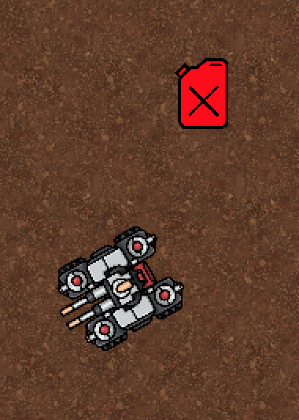
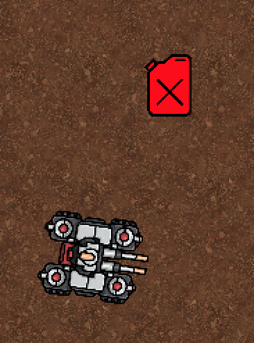
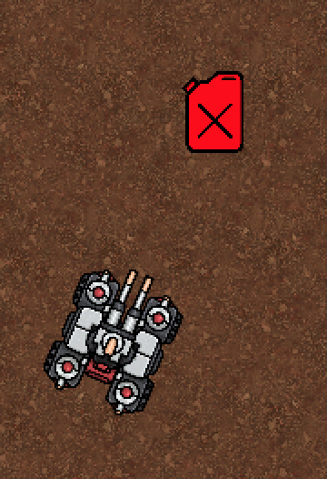

### Demo03 continued : our next Problem is "turning direction" i.e. clockwise or anticlockwise?

In the last commit I added a simple Rotate

```
this.transform.Rotate(0,0,calcAngleRadians * Mathf.Rad2Deg);
```

which only works if we want to turn clockwise, but fails if we need to turn anticlockwise

* Demo03-nextProblem-turningDirection-Start



### first turn - ought to be anti-clockwise (but we can only turn clockwise)

```
calcAngleRadians: 2.481677
UnityEngine.Debug:Log (object)
Drive:calcAngle () (at Assets/Drive.cs:25)
Drive:Update () (at Assets/Drive.cs:76)

Convert calcAngleRadians to regular angle142.1896
UnityEngine.Debug:Log (object)
Drive:calcAngle () (at Assets/Drive.cs:26)
Drive:Update () (at Assets/Drive.cs:76)

Unity angle142.1896
UnityEngine.Debug:Log (object)
Drive:calcAngle () (at Assets/Drive.cs:31)
Drive:Update () (at Assets/Drive.cs:76)
```

* Demo03-nextProblem-turningDirection-FirstTurn



### second turn - now clockwise


```
calcAngleRadians: 1.311074
UnityEngine.Debug:Log (object)
Drive:calcAngle () (at Assets/Drive.cs:25)
Drive:Update () (at Assets/Drive.cs:76)

Convert calcAngleRadians to regular angle75.11899
UnityEngine.Debug:Log (object)
Drive:calcAngle () (at Assets/Drive.cs:26)
Drive:Update () (at Assets/Drive.cs:76)

Unity angle75.11898
UnityEngine.Debug:Log (object)
Drive:calcAngle () (at Assets/Drive.cs:31)
Drive:Update () (at Assets/Drive.cs:76)
```

* Demo03-nextProblem-turningDirection-FinalTurnCorrect




## git log
```
~/projects/github/LearningMaths2D/docs $ git log -1
commit 87f3649ed35a27c9b4b9ba32237b5ebd1334e2b2 (HEAD -> main, origin/main)
Author: Dave Pitts <dgapitts@gmail.com>
Date:   Sun Aug 22 13:08:14 2021 +0200

    Demo03-continued-nextProblem-turningDirection
```
and
```
~/projects/github/LearningMaths2D/docs $ git show 87f3649ed35a27c9b4b9ba32237b5ebd1334e2b2
commit 87f3649ed35a27c9b4b9ba32237b5ebd1334e2b2 (HEAD -> main, origin/main)
Author: Dave Pitts <dgapitts@gmail.com>
Date:   Sun Aug 22 13:08:14 2021 +0200

    Demo03-continued-nextProblem-turningDirection

diff --git a/Assets/Drive.cs b/Assets/Drive.cs
index 9364be4..af9a2dc 100644
--- a/Assets/Drive.cs
+++ b/Assets/Drive.cs
@@ -29,9 +29,15 @@ public class Drive : MonoBehaviour

         // Final cross check using built in unity functions
         Debug.Log("Unity angle" + Vector3.Angle(tankUp, fuelDir));
+
+
+        // Un-signed angle - sometimes in right direction but sometime right amount but wrong direction
+        this.transform.Rotate(0,0,calcAngleRadians * Mathf.Rad2Deg);
+

     }

+
         void calcDistance()
     {
         Vector3 tankPos = transform.up; // tank Position / Facing direction
